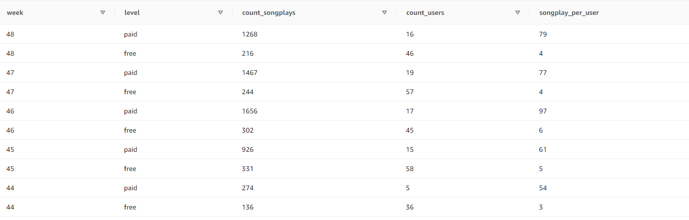
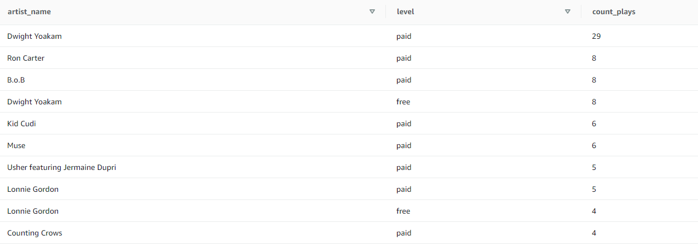

# Sparkify Data Warehouse

## Description

This project create a data warehouse in AWS Redshift Cloud service to help tracking the song play activities on Sparkify's music streaming app.

The source of the data contain JSON logs on user activity on the Sparkify app and the JSON metadata on the songs streamed in the app. Both of these log data reside in S3.

## ETL Pipeline
The ETL pipeline first loads the JSON log data from S3 to staging tables in Redshift. Transformation are also performed in Redshift to support the materialization of fact and dimension tables for internal analysis.

## Schema Design
The final dataset is designed on a STAR schema bases with one fact table on song plays and various dimension tables on the songs, artists, users, and time.
Please check the `sql_queries.py` file to see detailed configuration of each tables in the schema.
Here is a brief summary on each of the tables in the schema:
### fct_songplays
The fact table containing song play events and includes the following fields:
- songplay_id (unique key)
- start_time
- user_id
- level
- song_id
- artist_id
- session_id
- location
- user_agent

### dim_users
A dimension table containing list of users by attributes.It has the following fields
- user_id (unique key)
- first_name
- last_name
- gender
- level

## dim_songs
A dimension table containing the list of song by attributes. It has the following fields:
- song_id (unique key)
- title
- artist_id
- year
- duration

## dim_artists
A dimension table containing the list of artists by attributes. It has the following fields:
- artist_id (unique key)
- name
- location
- latitude
- longitude

## dim_time
A dimension table for time. It contains the following fields:
- start_time
- hour
- day
- week
- month
- year
- weekday

# Usage
**Major files for the project** are `create_tables.py`, `sql_queries.py`, and `etl.py`. 
**Optional files**: `analysis_queries.py`, `create_cluster.py`
## Prep Work: IAM Role and Redshift Cluster
This projects assume the following has been done:
1. An IAM user with S3 Readonly Access has been created
2. A Redshift cluster has been created
However, I have included option python file called `create_cluster.py` to assist with the creation of the IAM and Redshift cluster. Please run `python3 create_cluster.py` in your terminal to run this. After running this you can log into your AWS Redshift console and verify that a cluster has been created. 
**Please wait till it is available to proceed with the following steps**.

## Creating tables in Redshift
1. Ensure all the credentials in the dwh.cfg has been configured and entered properly
2. Please run `python3 create_tables.py` command in your terminal and wait till the run is finished
3. Once finished you can go to the Query Editor inside your Redshift Cluster to validate the successful creation of the staging tables, fact tables, and dimension tables.

## Running ETL Process
1. Once the tables are created, run `python3 etl.py`
2. Please note, depending on the number of nodes setup for your cluster, the time taken to finish the ETL run could vary.
3. After the ETL run has finished please visit the Query Editor and run SELECT statements to validate the data.

## Analysis and Validation

Note that I have created separate files to help me with the validation process. This is not required by the project, but I think it is a great opportunity to practice what I have learned. It is totally up to you to run them or not :)
The `analysis_queries.py` contains the validation and analysis queries. 
Run `python3 analysis_queries.py` in your terminal, and you will seethe queries returned to you after running it.

## Brief Sparkify Song Play Analysis

Sparify is a start up business looking into expanding its customer base at its early stage. Therefore, the most critical part for the internal decision maker to consider would be increasing the number of Paid users. 
The analysis I have performed is not a complete set of the analysis but will set a great foundation.

## Analysis on Current User Songplays by Level
Running the following query:

```
WITH base AS (
SELECT 
sp.*
, time.week
, time.weekday

FROM public.fct_songplays AS sp
LEFT JOIN public.dim_time AS time
  ON sp.start_time = time.start_time
)
SELECT 
week
, level
, COUNT(songplay_id) AS count_songplays
, COUNT(DISTINCT user_id) AS count_users
, COUNT(songplay_id) / COUNT(DISTINCT user_id) songplay_per_user
FROM base
GROUP BY 1,2
ORDER BY week DESC
```
will give us the following



- We notice that Paid customers play way more times than Free customers on a weekly basis

## Analysis on Artists that Users Listen To
This analysis could be improved if we can have genre and popularity information about the artists. 
The following query was run:

```
WITH base AS (
SELECT 
    sp.*
    , a.artist_name

FROM public.fct_songplays AS sp
LEFT JOIN public.dim_artists AS a
  ON sp.artist_id = a.artist_id
WHERE a.artist_name IS NOT NULL
)

SELECT
  artist_name
  , level
  , COUNT(songplay_id) AS count_plays
 FROM base
 GROUP BY 1,2
 ORDER BY 3 DESC
 LIMIT 10
```

The following results were returned:



- the artist Dwight Yoakam appears to be the most popular artist played by Paid customers
- future analysis could be done towards why Paid customer listened to this artist more than others

## Other Future Analysis
Here are a list of potential analysis to be performed, assume we can get more data:
- what genre triggers current Paid customer converting with us
- who is the most popular artist played by Free customers
- what are the profiles of Paid customers compared to Free customers
... and more

